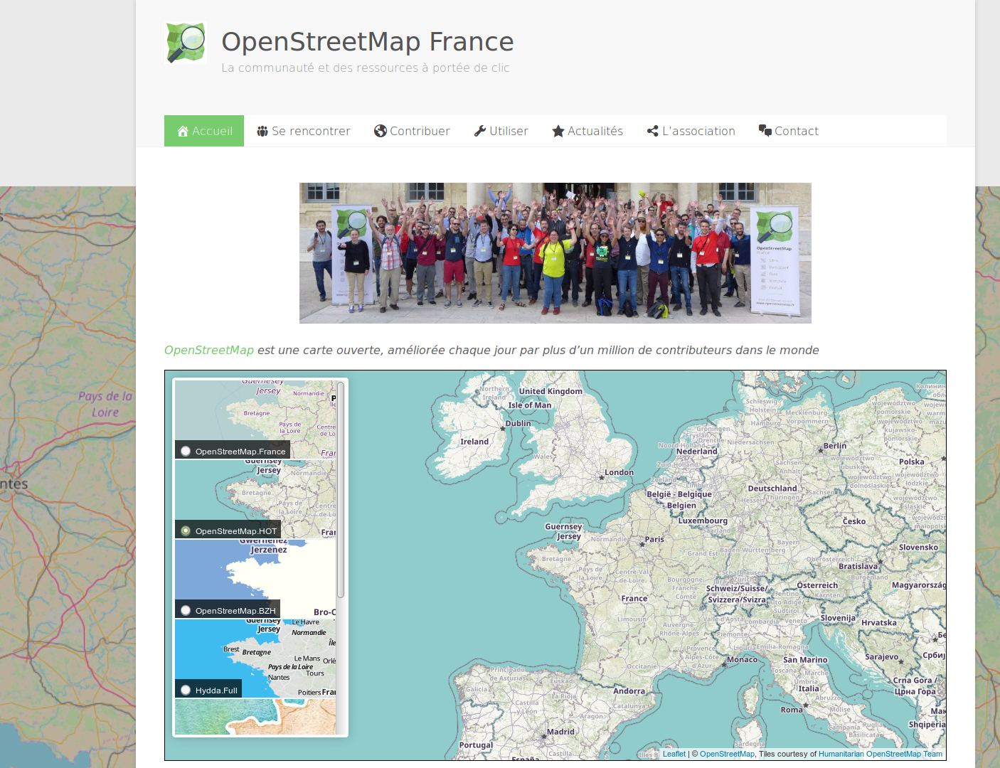

# osm-fr-front-map

Une petite carte avec des sélecteurs pour varier entre différents fonds de carte.

Cette carte est utilisée notamment sur la page d'accueil du [site d'OpenStreetMap France](https://www.openstreetmap.fr/):

